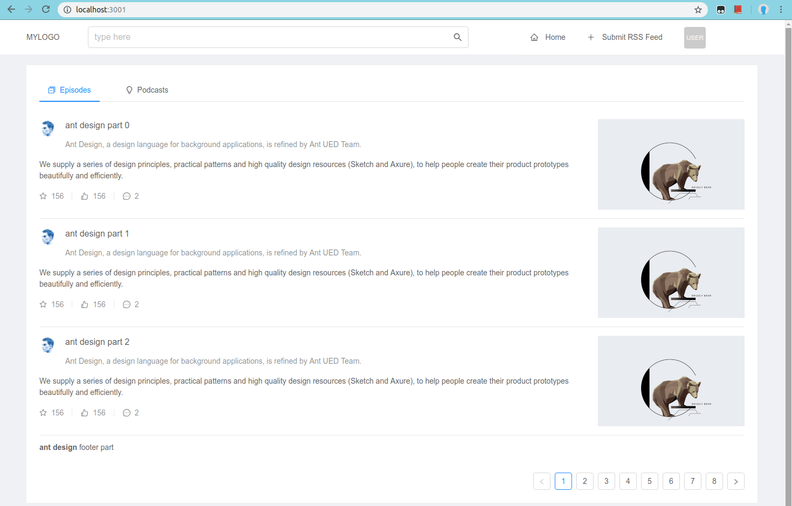

ReactJS + [Amazon Cognito](https://aws.amazon.com/cognito/) + [Amazon Amplify Framework](https://aws-amplify.github.io/docs/js/start) Starter Project
===================================================

### Author: Vladimir Budilov
* [YouTube](https://www.youtube.com/channel/UCBl-ENwdTlUsLY05yGgXyxw)
* [LinkedIn](https://www.linkedin.com/in/vbudilov/)
* [Medium](https://medium.com/@budilov)

Use this project to quickly get started with ReactJS + Amazon Cognito.

### Update the Cognito configuration
First and foremost, create a Cognito User Pool. Then open 'src/configs/aws-configs.js' and update the `aws_user_pools_id` and the `aws_user_pools_web_client_id` properties.
 
```json
const awsConfig = {
    aws_app_analytics: 'enable',

    aws_user_pools: 'enable',
    aws_user_pools_id: 'us-east-1_x',
    aws_user_pools_mfa_type: 'OFF',
    aws_user_pools_web_client_id: 'x',
    aws_user_settings: 'enable',
};

export default awsConfig
```

### Build the project and run it locally (the default url is 'http://localhost:3000')

```yarn install && yarn start```

### Build for PRD

```yarn build```

### Screenshots




